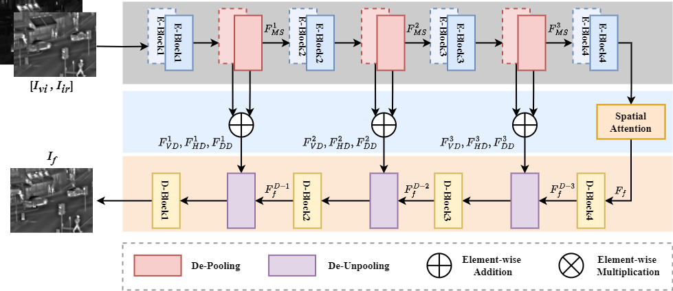
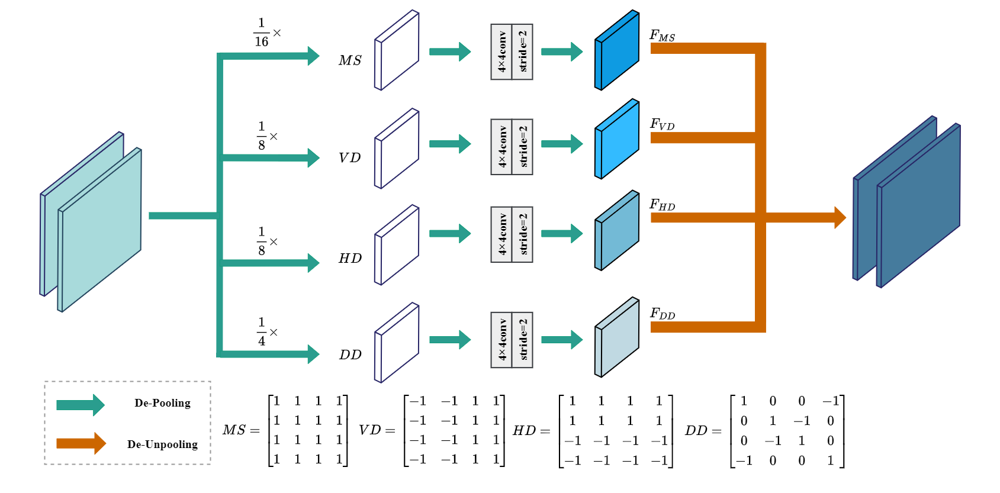

# DePF

This is the code of the paper titled as "DePF: A Novel Fusion Approach based on Decomposition Pooling for Infrared and Visible Images". 

The article is accepted by **IEEE Transactions on Instrumentation and Measurement**.

# Framework



# Decomposition Pooling



# Environment

- Python 3.9.13
- torch 1.12.1
- torchvision 0.13.1
- tqdm 4.64.1

# To Train

We train our network using [MS-COCO 2014](http://images.cocodataset.org/zips/train2014.zip)(T.-Y. Lin, M. Maire, S. Belongie, J. Hays, P. Perona, D. Ramanan, P. Dollar, and C. L. Zitnick. Microsoft coco: Common objects in context. In ECCV, 2014. 3-5.)

You can run the following prompt:

```python
python train_auto_encoder.py
```

# To Test

Put your image pairs in the "test_images" directory and run the following prompt: 

```python
python test.py
```

# Acknowledgement

- Our code of training is based on the [DenseFuse](https://github.com/hli1221/densefuse-pytorch).
- For calculating the image quality assessments, please refer to this [Metric](https://github.com/Linfeng-Tang/Evaluation-for-Image-Fusion).

# Contact Informaiton

If you have any questions, please contact me at <yongbiao_xiao_jnu@163.com>.

# Citation

